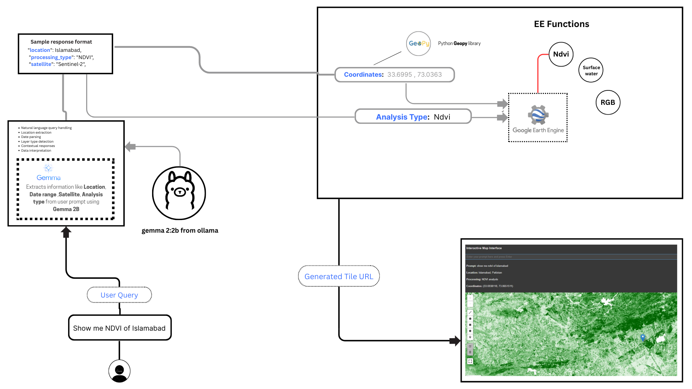
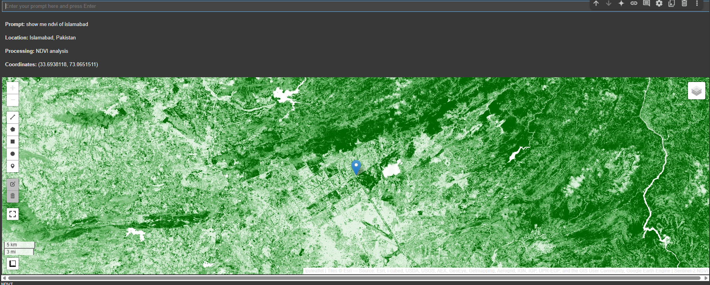

# Generative Earth Engine - Proof of Concept (PoC)

This notebook serves as a **Proof of Concept (PoC)** for a Generative Earth Engine, showcasing how open-source frameworks like **LangChain** can be integrated with the function-calling capabilities of **Large Language Models (LLMs)**, specifically **Gemma 2B via Ollama**, to enable geospatial data analysis using natural language prompts.

## Objective

The objective is to develop a **geospatial chatbot** that:

- Understands and interprets user input in natural language
- Executes relevant geospatial analysis tasks
- Leverages the **Google Earth Engine Python API** for data processing and analysis

---

## 🔧 System Architecture

The following diagram illustrates the overall architecture of the system, including model integration, prompt handling, geocoding, Earth Engine function execution, and visualization in an interactive map interface:

---

## 🌍 Example Output

Below is a screenshot of the interactive map interface responding to a natural language prompt, executing Earth Engine functions accordingly:

---

## Vision

This notebook lays the groundwork for building a full-scale **GeoLLM application** capable of automating complex geospatial workflows through intuitive **prompt-based interactions**. The system has potential for:

- Simplifying Earth observation data access
- Reducing the learning curve for geospatial scripting
- Enabling scalable and user-friendly geospatial automation

## Technologies Used

- 🧠 Gemma 2B (via Ollama)
- 🔗 LangChain
- 🌍 Earth Engine Python API
- 🐍 Python 3.x
- 📦 Open-source tools and frameworks

---

> 🚀 Future expansions may include GUI integration, multi-modal input support, and deployment as a web-based geospatial assistant.
